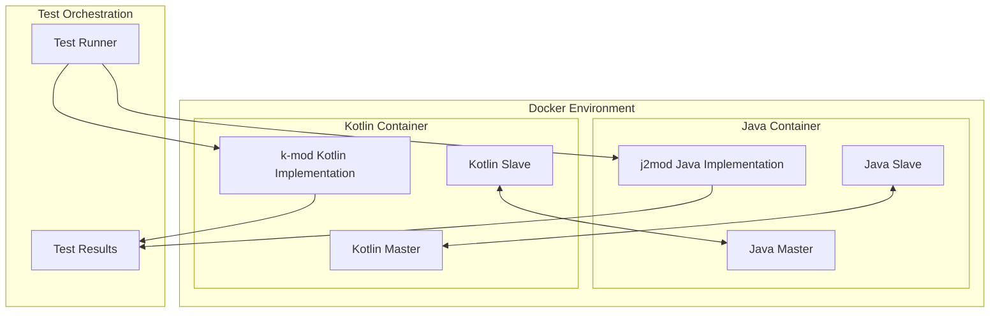
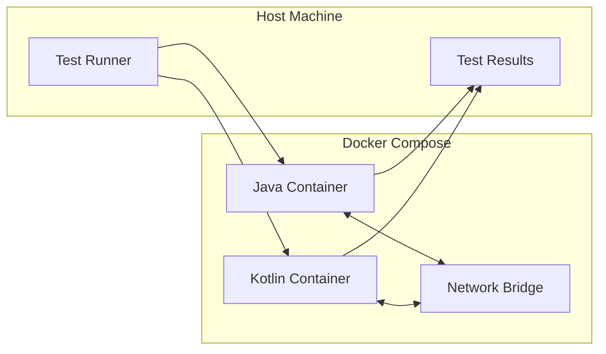
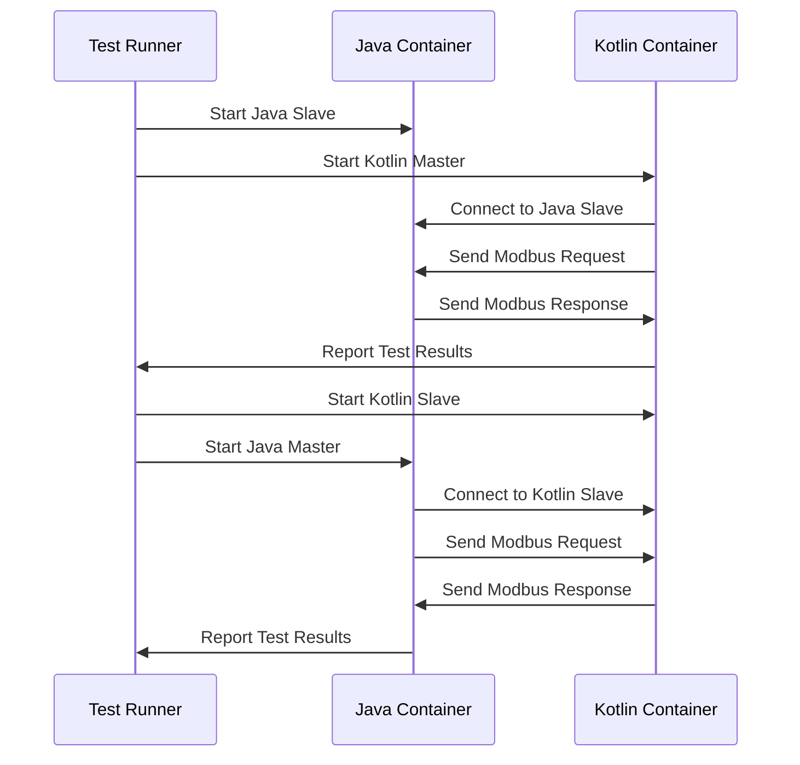
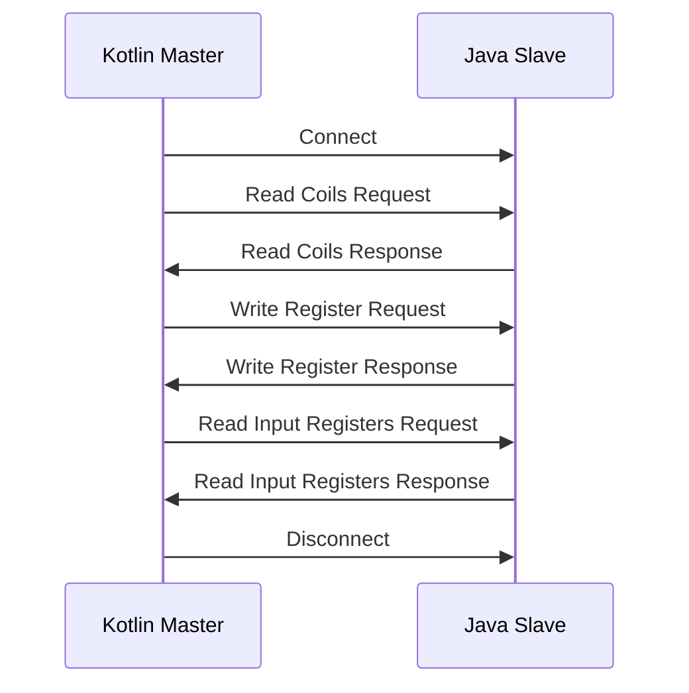
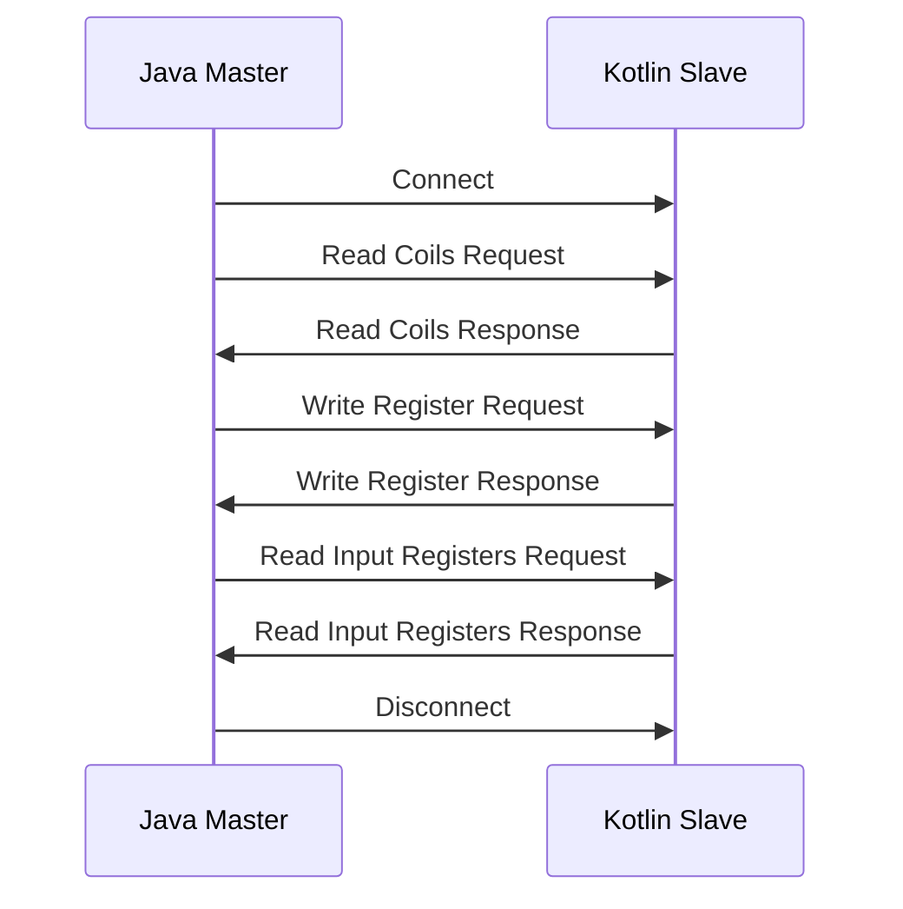

# Testing Strategy for k-mod (Kotlin Port of j2mod)

This document outlines the testing approach for ensuring that the Kotlin Multiplatform (KMP) port of j2mod works correctly by connecting it to the dockerized existing Java implementation from Maven Central.

## Table of Contents

- [Overview](#overview)
- [Testing Architecture](#testing-architecture)
- [Docker-Based Testing Approach](#docker-based-testing-approach)
- [Test Categories](#test-categories)
- [Interoperability Testing](#interoperability-testing)
- [GitHub Actions Integration](#github-actions-integration)
- [Test Case Examples](#test-case-examples)
- [Troubleshooting](#troubleshooting)

## Overview

The k-mod project is a Kotlin Multiplatform port of the j2mod library, which provides Modbus protocol support for various platforms including JVM, iOS, and browser environments. To ensure the Kotlin port maintains compatibility with the original Java implementation, we need a comprehensive testing strategy that verifies:

1. **Functional Equivalence**: The Kotlin implementation should behave identically to the Java implementation for all supported Modbus protocols (TCP, UDP, RTU over TCP, Serial RTU, Serial ASCII).

2. **Interoperability**: The Kotlin implementation should be able to communicate with the Java implementation in both directions (Kotlin Master ↔ Java Slave and Java Master ↔ Kotlin Slave).

3. **Cross-Platform Consistency**: The Kotlin implementation should behave consistently across all supported platforms (JVM, iOS, browser).

4. **Performance**: The Kotlin implementation should have comparable or better performance than the Java implementation.

## Testing Architecture

The testing architecture uses Docker containers to create isolated environments for testing the Kotlin port against the Java implementation.



## Docker-Based Testing Approach

We use Docker to create isolated environments for testing the Kotlin port against the Java implementation. This approach has several advantages:

1. **Isolation**: Docker containers provide isolated environments that prevent interference between tests.
2. **Reproducibility**: Docker ensures that tests run in the same environment every time.
3. **Portability**: Docker containers can run on any platform that supports Docker.
4. **Scalability**: Docker Compose allows us to orchestrate multiple containers for complex testing scenarios.

### Docker Setup

The Docker setup consists of two main containers:

1. **Java Container**: Contains the Java implementation of j2mod from Maven Central.
2. **Kotlin Container**: Contains the Kotlin port of j2mod (k-mod).



### Test Flow

The test flow follows these steps:



## Test Categories

The testing strategy includes the following categories of tests:

### 1. Unit Tests

Unit tests verify the behavior of individual components in isolation. These tests are implemented using the Kotlin test framework and run on each supported platform.

### 2. Integration Tests

Integration tests verify the interaction between components within the Kotlin implementation. These tests ensure that the components work together correctly.

### 3. Interoperability Tests

Interoperability tests verify that the Kotlin implementation can communicate with the Java implementation in both directions. These tests are crucial for ensuring compatibility.

### 4. Protocol-Specific Tests

Protocol-specific tests verify the behavior of each supported Modbus protocol (TCP, UDP, RTU over TCP, Serial RTU, Serial ASCII). These tests ensure that the Kotlin implementation correctly implements each protocol.

### 5. Performance Tests

Performance tests measure the performance of the Kotlin implementation compared to the Java implementation. These tests help identify performance bottlenecks and ensure that the Kotlin implementation meets performance requirements.

## Interoperability Testing

Interoperability testing is a key aspect of the testing strategy. It ensures that the Kotlin implementation can communicate with the Java implementation in both directions.

### Java Slave ↔ Kotlin Master



### Kotlin Slave ↔ Java Master



## GitHub Actions Integration

GitHub Actions can be used to automate the testing process. Here's a suggested workflow for testing the Kotlin port using GitHub Actions:

```yaml
name: k-mod Tests

on:
  push:
    branches: [ main, develop ]
  pull_request:
    branches: [ main, develop ]

jobs:
  test:
    runs-on: ubuntu-latest
    
    steps:
    - uses: actions/checkout@v3
    
    - name: Set up JDK 11
      uses: actions/setup-java@v3
      with:
        java-version: '11'
        distribution: 'temurin'
    
    - name: Set up Docker
      uses: docker/setup-buildx-action@v2
    
    - name: Build and run tests
      run: |
        docker-compose build
        docker-compose run k-mod-test
    
    - name: Upload test results
      uses: actions/upload-artifact@v3
      with:
        name: test-results
        path: test-results/
```

For iOS testing, you can use a macOS runner:

```yaml
  ios-test:
    runs-on: macos-latest
    
    steps:
    - uses: actions/checkout@v3
    
    - name: Set up JDK 11
      uses: actions/setup-java@v3
      with:
        java-version: '11'
        distribution: 'temurin'
    
    - name: Build and run iOS tests
      run: ./gradlew iosX64Test
```

## Test Case Examples

Here are some examples of test cases for verifying the Kotlin port against the Java implementation:

### Example 1: Testing Kotlin Master with Java Slave

```kotlin
class KotlinMasterJavaSlaveTest {
    private lateinit var javaSlave: Process
    private lateinit var kotlinMaster: ModbusTCPMaster
    
    @BeforeTest
    fun setUp() {
        // Start Java slave in Docker container
        javaSlave = ProcessBuilder("docker", "run", "--rm", "-p", "2502:2502", "j2mod-slave").start()
        
        // Wait for slave to start
        Thread.sleep(2000)
        
        // Create Kotlin master
        kotlinMaster = ModbusTCPMaster("localhost", 2502)
        kotlinMaster.connect()
    }
    
    @AfterTest
    fun tearDown() {
        kotlinMaster.disconnect()
        javaSlave.destroy()
    }
    
    @Test
    fun testReadHoldingRegisters() {
        // Read holding registers from Java slave using Kotlin master
        val registers = kotlinMaster.readMultipleRegisters(15, 0, 10)
        
        // Verify the values
        assertEquals(10, registers.size)
        assertEquals(251, registers[0].value)
    }
}
```

### Example 2: Testing Java Master with Kotlin Slave

```kotlin
class JavaMasterKotlinSlaveTest {
    private lateinit var kotlinSlave: ModbusSlave
    private lateinit var javaMaster: Process
    
    @BeforeTest
    fun setUp() {
        // Create and start Kotlin slave
        kotlinSlave = ModbusSlaveFactory.createTCPSlave(2502, 20)
        kotlinSlave.addProcessImage(15, getSimpleProcessImage())
        kotlinSlave.open()
        
        // Start Java master in Docker container
        javaMaster = ProcessBuilder("docker", "run", "--rm", "--network=host", "j2mod-master").start()
    }
    
    @AfterTest
    fun tearDown() {
        kotlinSlave.close()
        javaMaster.destroy()
    }
    
    private fun getSimpleProcessImage(): SimpleProcessImage {
        val spi = SimpleProcessImage(15)
        val register = SimpleRegister(251)
        spi.addRegister(register)
        return spi
    }
    
    @Test
    fun testJavaMasterWithKotlinSlave() {
        // The Java master runs tests inside the Docker container
        // We just need to verify that it exits with code 0 (success)
        val exitCode = javaMaster.waitFor()
        assertEquals(0, exitCode)
    }
}
```

## Troubleshooting

### Common Issues and Solutions

1. **Port Conflicts**: If you encounter port conflicts (e.g., port 2502 is already in use), you can modify the port in the test scripts.

2. **Network Connectivity**: If the containers cannot communicate with each other, make sure they are on the same Docker network.

3. **Memory Issues**: If you encounter memory issues, you can adjust the memory allocation in the Docker Compose file.

4. **Test Failures**: If tests fail, check the test logs for error messages. Common issues include:
   - Incorrect protocol configuration
   - Timing issues (try increasing timeouts)
   - Endianness issues (make sure byte order is consistent)

### Debugging Tips

1. **Enable Debug Logging**: Add debug logging to your tests to help diagnose issues.

2. **Inspect Docker Containers**: Use `docker logs` to view the logs of running containers.

3. **Use Wireshark**: Capture network traffic to analyze Modbus messages.

4. **Step-by-Step Testing**: Test each component individually before testing them together.